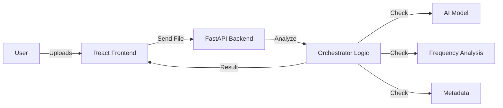

# 📘 DeepGuard Developer & Learning Guide

Welcome to the **DeepGuard** project! This guide is designed to take you from "I know nothing about this project" to "I understand how every piece fits together."

---

## 1. 🌟 The Big Picture
**DeepGuard** is a system that detects "Deepfakes"—fake images or videos generated by AI (like Midjourney, Sora, or FaceSwap).

### How it works (The 10,000 ft view)
1.  **User** uploads a photo/video on the **Website** (Frontend).
2.  **Website** sends the file to the **Server** (Backend).
3.  **Server** looks at the file using multiple "Eyes" (AI Models):
    *   **The Artist Eye (CNN)**: Looks for visual artifacts humans can't see.
    *   **The Physicist Eye (FFT)**: Looks at frequency patterns (real cameras leave specific noise).
    *   **The Investigator Eye (Metadata)**: Checks file history (EXIF data).
4.  **Server** combines these opinions into a final **Verdict** (Real/Fake).
5.  **Website** shows the result to the user.



---

## 2. 📂 Project Structure Map
Think of the project as a house with two main rooms: `src` (Frontend) and `backend` (Server).

### 🏠 Frontend (`/src`) - The "Living Room"
This is what the user sees. It's built with **React**.

*   `src/App.tsx`: The main entrance. Handles routing (which page to show).
*   `src/pages/`: The actual screens.
    *   `Index.tsx`: The home page with the upload box.
*   `src/components/`: Reusable furniture (Buttons, Cards, Upload Box).
    *   `FileUpload.tsx`: The box where you drop files.
*   `src/lib/`: Helper tools (like api client).

### ⚙️ Backend (`/backend`) - The "Engine Room"
This is where the magic happens. It's built with **Python** and **FastAPI**.

*   `app/main.py`: The front door of the server. Receives requests.
*   `app/orchestrator.py`: **The Brain**. This decides if something is real or fake using all signals.
*   `app/models/`: Where the AI brains (model weights) are stored.
*   `app/engines/`: specialized workers.
    *   `cnn.py`: Runs the Neural Network.
    *   `fft_detector.py`: unexpected frequency analyzer.
    *   `exif_detector.py`: Metadata checker.

---

## 3. 🧠 Core Concepts (Simplified)

### What is a CNN? (Convolutional Neural Network)
Imagine a panel of judges inspecting a painting. One judge looks only at textures, another looks at shadows, another at eyes. A CNN is a computer program that does this. We trained our CNN on thousands of Real and Fake images so it learned the difference.

### What is FFT? (Fast Fourier Transform)
Real cameras leave a specific "fingerprint" of invisible noise on an image. AI generators often smear this noise or create perfect patterns. FFT allows us to "hear" the visual noise.
*   **Real Image**: Chaotic, natural noise.
*   **AI Image**: Too smooth or weirdly repetitive.

---

## 4. 🚶‍♂️ Walkthrough: The Life of a Request

Let's trace exactly what happens when you press "Upload".

### Step 1: Frontend triggers
In `src/pages/Index.tsx`, the `handleUpload` function is called. It wraps the file in a `FormData` object (like putting a letter in an envelope).

### Step 2: API Call
It sends a `POST` request to `http://localhost:8000/api/predict`.

### Step 3: Backend Receives
In `backend/app/routes/predict.py`, the `predict` endpoint wakes up.
1.  It saves the file temporarily to disk.
2.  It calls `orchestrate_detection(file_path)`.

### Step 4: The Orchestra Plays (`orchestrator.py`)
This is the most important file (`backend/app/orchestrator.py`).
1.  **Check 1**: runs `fft_score()` -> Returns 0-100 (High means weird freq).
2.  **Check 2**: runs `run_cnn()` -> Returns % probability of being fake.
3.  **Check 3**: runs `extract_exif()` -> Checks camera make/model data.
4.  **Decision**: It runs logic like:
    > "If the CNN says FAKE, but the FFT says 'Definitely Real Camera Noise', trust the FFT and lower the Fake score."

### Step 5: The Response
The server sends back JSON:
```json
{
  "verdict": "FAKE",
  "confidence": 92,
  "details": { "facialAnalysis": 95, "artifactDetection": 88 }
}
```

### Step 6: Frontend Display
The React component reads this JSON and updates the UI state `setResult(...)`. The progress bar animates to 92% Red.

---

## 5. 🛠️ How to Modify (Your First Task)

Want to leave your mark? Try this simple change.

**Task**: Change the "Confidence" text to say "Probability".

1.  Open `src/components/AnalysisResult.tsx` (or search for where the result is shown in `VerificationResult.tsx`).
2.  Find the text `Confidence Score`.
3.  Change it to `Probability of Manipulation`.
4.  Save.
5.  Look at your browser—it updates instantly (Hot Reloading)!

---

## 6. 🎓 Next Steps for You

1.  **Read `backend/app/orchestrator.py`**: It's Python code, but read the comments. It explains the *logic* of detection.
2.  **Look at `src/pages/Index.tsx`**: See how the frontend state manages the "Analyzing..." loading screen.
3.  **Experiment**: Try uploading a real photo from your phone vs an AI image you make online. See how the `FFT` score differs in the backend logs!

Happy Coding! 🚀
